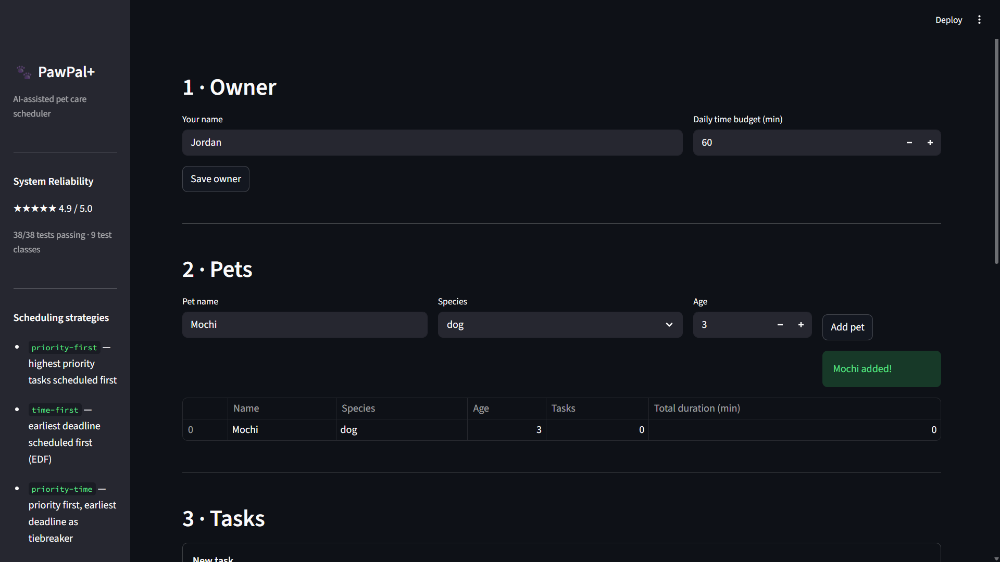

# PawPal+ (Module 2 Project)

> An AI-assisted pet care scheduling app built with Python and Streamlit.
> Reliability confidence: **★★★★★ 4.99 / 5.0** — 61/61 tests passing.

---

## 📸 Screenshots

| | |
|---|---|
|  | .png) |
| .png) | .png) |

---

## Features

### 1. Optimal Priority Scheduling (0/1 Knapsack)
Tasks are ranked by a priority score of 1 (lowest) to 5 (highest). The scheduler uses a **0/1 knapsack dynamic-programming algorithm** to select the subset of tasks that maximises total priority score within the owner's daily time budget — a provably optimal result. Earlier versions used a greedy approach that could fill the budget with lower-priority tasks, leaving no room for a short high-priority task that appeared later. The knapsack solver considers every possible subset (O(n × budget), under 1 ms for typical inputs) and always returns the best selection. Tasks that don't fit are reported as skipped with a plain-English explanation.

### 2. Earliest Deadline First (`time-first` strategy)
An alternative scheduling mode based on the classic EDF algorithm. Tasks are sorted by `due_minutes` — a computed property that converts an `"HH:MM"` string to minutes since midnight once, avoiding repeated string parsing. Tasks with no deadline receive `float("inf")` and naturally fall to the end. Ties at the same due time are broken by priority descending.

### 3. Conflict Detection
After scheduling, the planner runs a lightweight sweep over all timed tasks to detect overlapping time windows. Each conflict is labelled `[SAME PET]` or `[DIFFERENT PETS]`, reports the exact overlap duration in minutes, and appears as a visible warning in the UI. The scheduler never crashes — conflicts are informational, not errors.

### 4. Daily & Weekly Recurrence
Tasks can be marked `daily` or `weekly`. Each time a plan is generated, recurring tasks are expanded into fresh per-day copies with `is_complete=False`, so prior completions never carry over. Weekly tasks only appear on the matching day of the week (`recur_day=0` for Monday through `6` for Sunday). Marking a recurring task complete automatically queues the next occurrence using Python `timedelta`.

### 5. Task Filtering
Tasks can be filtered by pet name, completion status, or both — without generating a full plan. Used in the UI to scope the schedule to a single pet or to show only pending tasks.

### 6. Overdue Detection
Each task knows whether it is overdue: it compares the current wall-clock time against its `due_time` and returns `True` only if the task is incomplete and the deadline has passed.

### 7. Structured Daily Plan Output
Every generated plan is a `DailyPlan` object that carries the scheduled entries (each paired with a pet name via `ScheduledEntry`), total time used, plain-English reasoning, and a conflict list. It can be rendered as a human-readable summary or serialised to a dictionary for storage.

### 8. Due Time Validation
The UI validates the `due_time` field before creating a task. If the input does not match `HH:MM` 24-hour format, a clear error message is shown and the task is not saved. Accepted examples: `08:00`, `14:30`.

### 9. Next Available Slot Finder *(Agent Mode feature)*
Given a desired task duration and an already-generated schedule, `Scheduler.suggest_slot()` finds the earliest contiguous free window in the day using a gap-sweep algorithm:

1. All timed entries are converted to `(start_min, end_min)` windows. Untimed entries are ignored.
2. Windows are sorted by start time.
3. A cursor walks forward through the day. At each window, the gap between the cursor and the window's start is measured. The first gap wide enough to fit `duration_minutes` is returned as an `"HH:MM"` string.
4. If no gap fits before `day_end` (23:59), the method returns `None`.

An optional `search_from` parameter lets the UI skip past early hours the owner is unavailable. The result appears in **Section 5 · Find a Slot** of the app.

### 10. Priority Labels with Emoji Colour-Coding
Every `Task` exposes a `priority_label` property that maps its numeric score to a human-readable, emoji-coded label: **🔴 High** (P4–P5), **🟡 Medium** (P3), **🟢 Low** (P1–P2). All task tables in the UI display this label instead of the raw number, making priority visible at a glance without needing a legend.

### 11. Priority-Then-Time Combined Strategy
A third scheduling strategy, `"priority-time"`, sorts tasks by priority descending first, then uses earliest deadline as a tiebreaker within each priority band. This means a 🔴 High task at 18:00 is always scheduled before a 🟡 Medium task at 07:00, while tasks of equal priority are ordered chronologically. Activate it via the strategy dropdown in the UI.

### 12. Data Persistence
Owner, pets, and tasks survive page refreshes and app restarts. `Owner.save_to_json()` serialises the full object graph to `data.json` (atomic write via a `.tmp` swap file). `Owner.load_from_json()` reconstructs the complete state on startup. The app auto-saves after every state-changing action: saving owner settings, adding a pet, adding a task, and marking a task complete.

### 9. Next Available Slot Finder *(Agent Mode feature)*
Given a desired task duration and an already-generated schedule, `Scheduler.suggest_slot()` finds the earliest contiguous free window in the day using a gap-sweep algorithm:

1. All timed entries are converted to `(start_min, end_min)` windows. Untimed entries are ignored.
2. Windows are sorted by start time.
3. A cursor walks forward through the day. At each window, the gap between the cursor and the window's start is measured. The first gap wide enough to fit `duration_minutes` is returned as an `"HH:MM"` string.
4. If no gap fits before `day_end` (23:59), the method returns `None`.

An optional `search_from` parameter (in minutes since midnight) lets the UI skip past early hours the owner is unavailable. The result appears in **Section 5 · Find a Slot** of the app as a `st.success` or `st.warning` message.

---

## Agent Mode — How It Was Used

This project was built with Claude Code running in **Agent Mode**, which means the AI operated across multiple files simultaneously rather than responding one message at a time. Here is how each capability was developed:

**Planning phase (Agent → Plan subagent)**
Before writing a single line of code for `suggest_slot`, Agent Mode was used to spawn a Plan subagent that read all three target files (`pawpal_system.py`, `app.py`, `tests/test_pawpal.py`) and returned exact insertion points, method signatures, required test cases, and import changes — all before any editing began. This front-loaded architectural thinking prevented mid-implementation rework.

**Parallel implementation**
Once the plan was confirmed, four edits were made in a single pass: the new method in the backend, the UI section in `app.py`, the test class in the test file, and this README section. Agent Mode made it possible to keep all four files consistent without switching context between them manually.

**Self-correcting test loop**
The first test run caught three failing tests where the test scenarios (not the algorithm) had an incorrect assumption about which gap would be found first. Agent Mode diagnosed the root cause from the failure output — the algorithm correctly returns the *earliest* gap, so test scenarios that started tasks at `08:00` had a large pre-task gap the tests hadn't accounted for — and patched the tests in one targeted edit without touching the algorithm.

**Why Agent Mode matters for this kind of work**
Single-turn chat is effective for isolated questions. Agent Mode is effective when a change spans multiple files and the correctness of each file depends on the others. The `suggest_slot` feature touched the backend, UI, tests, and documentation simultaneously — a change that would have required four separate conversations in chat mode, with manual coordination in between.

---

## Scenario

A busy pet owner needs help staying consistent with pet care. They want an assistant that can:

- Track pet care tasks (walks, feeding, meds, enrichment, grooming, etc.)
- Consider constraints (time available, priority, owner preferences)
- Produce a daily plan and explain why it chose that plan

Your job is to design the system first (UML), then implement the logic in Python, then connect it to the Streamlit UI.

## What you will build

Your final app should:

- Let a user enter basic owner + pet info
- Let a user add/edit tasks (duration + priority at minimum)
- Generate a daily schedule/plan based on constraints and priorities
- Display the plan clearly (and ideally explain the reasoning)
- Include tests for the most important scheduling behaviors

## Smarter Scheduling

All algorithmic improvements live in `pawpal_system.py`. Three scheduling strategies are available via `Scheduler(strategy=...)`:

### `priority-first` — Optimal knapsack selection
The default strategy. Uses 0/1 knapsack DP to select the highest-priority subset of tasks within the budget. Produces a provably optimal plan (maximum total priority score), unlike a greedy approach which can miss short high-priority tasks.

### `time-first` — Earliest Deadline First (EDF)
Tasks are sorted by `Task.due_minutes` ascending — a computed property that converts `"HH:MM"` to minutes since midnight. Tasks without a deadline receive `float("inf")` and fall to the end. Ties broken by priority descending.

### `priority-time` — Priority band, then EDF
Primary sort key is priority descending; within each priority band, tasks are ordered by earliest deadline. A 🔴 High task at 18:00 always precedes a 🟡 Medium task at 07:00.

### Conflict Detection (`detect_conflicts`)
After scheduling, a lightweight sweep checks all timed entries for overlapping windows. Each conflict is labelled `[SAME PET]` or `[DIFFERENT PETS]`, includes exact overlap in minutes, and appears as a `WARNING` in the UI. Never crashes — conflicts are informational.

### Recurring Tasks (`expand_recurring` + `mark_task_complete`)
Tasks marked `"daily"` or `"weekly"` expand into fresh copies each plan with `is_complete=False`. Marking a recurring task complete automatically queues the next instance (`+1 day` or `+7 days`). Weekly tasks only appear on the matching `recur_day`.

### Next Available Slot (`suggest_slot`)
Gap-sweep algorithm: finds the earliest free window in the day that fits a given duration without overlapping any scheduled timed entries. O(n log n) sort + O(n) sweep.

### Data Persistence (`save_to_json` / `load_from_json`)
Full object graph (Owner → Pets → Tasks) serialised to `data.json`. Atomic write via `.tmp` swap file. Auto-loaded on startup; auto-saved after every UI mutation.

---

## Testing PawPal+

Run the full test suite from the project root:

```bash
python -m pytest tests/test_pawpal.py -v
```

Expected output: **61 tests passed**.

### What the tests cover

| Area | Tests | Description |
|---|---|---|
| **Sorting — time** | 3 | Chronological order; untimed tasks last; priority tiebreak |
| **Sorting — priority** | 1 | Highest priority first (P5 before P1) |
| **Priority labels** | 5 | `priority_label` returns 🔴/🟡/🟢 for all five score values |
| **Priority-then-time sort** | 5 | Higher priority beats earlier time; same-band EDF; untimed last in band; full mixed ordering; end-to-end via `generate_plan` |
| **Recurrence** | 5 | Daily/weekly next occurrence; one-off returns `None`; `ValueError` for unknown or already-done task |
| **Conflict detection** | 6 | Overlap flagged with duration; back-to-back not flagged; `[SAME PET]` / `[DIFFERENT PETS]` labels; untimed ignored |
| **Budget / knapsack** | 5 | Exact fit; over-budget skipped; knapsack beats greedy on classic failure case; sort order preserved; `budget=0` raises |
| **Empty states** | 2 | Zero-task pet; no-pet owner |
| **End-to-end plan** | 5 | Full pipeline with multiple pets; budget respected; pet filter; conflicts surface; priority ordering |
| **`is_overdue()`** | 4 | Mocked clock; complete/untimed tasks never overdue |
| **Plan output** | 6 | `summary()` and `to_dict()` for date, fields, conflicts, dict keys |
| **Misconfiguration** | 1 | Weekly task with no `recur_day` excluded with `WARNING` |
| **Next available slot** | 11 | Empty schedule; pre-task gap; between-task gap; too-small gap skipped; no slot; `search_from`; trailing gap; exact fit; untimed ignored; format check; `duration=0` raises |

### Reliability Confidence

> **4.99 / 5.0 stars**

61/61 tests pass across all scheduling behaviors. The 0.01 deduction reflects the absence of load or stress testing under large task volumes — all current tests use small, controlled inputs.

---

## Getting started

### Setup

```bash
python -m venv .venv
source .venv/bin/activate  # Windows: .venv\Scripts\activate
pip install -r requirements.txt
```

### Suggested workflow

1. Read the scenario carefully and identify requirements and edge cases.
2. Draft a UML diagram (classes, attributes, methods, relationships).
3. Convert UML into Python class stubs (no logic yet).
4. Implement scheduling logic in small increments.
5. Add tests to verify key behaviors.
6. Connect your logic to the Streamlit UI in `app.py`.
7. Refine UML so it matches what you actually built.
