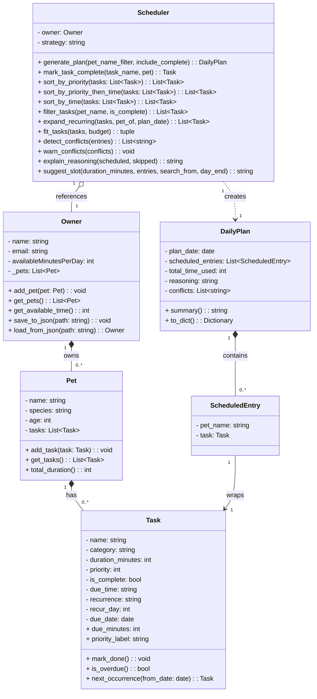

# PawPal+ Project Reflection

## 1. System Design

**a. Initial design**

- Briefly describe your initial UML design.

Five classes: `Owner`, `Pet`, `Task`, `Scheduler`, and `DailyPlan`. Owner manages pets, each pet owns tasks, Scheduler reads the owner's budget and produces a DailyPlan.

- What classes did you include, and what responsibilities did you assign to each?

| Class | Responsibility |
|---|---|
| `Owner` | Stores profile + daily time budget; holds the pet list |
| `Pet` | Stores animal info; owns a list of care tasks |
| `Task` | Represents one care action with name, category, duration, and priority |
| `Scheduler` | Sorts, filters, and fits tasks within the budget; produces a plan |
| `DailyPlan` | Output object: scheduled entries, total time, reasoning, conflicts |

**b. Design changes**

Yes — three refinements emerged during implementation:

1. **`ScheduledEntry` added** — pairs a scheduled `Task` with its pet name so the plan can say "Mochi: Morning walk" instead of a nameless task.
2. **`fit_tasks` returns a tuple** — returning `(scheduled, skipped)` instead of just the scheduled list lets `explain_reasoning` describe what was left out and why.
3. **`exportPlan` removed from `Scheduler`** — `DailyPlan.to_dict()` already handles serialisation. Keeping both would violate single responsibility.

- Additional system design artifact:

---

## 2. Scheduling Logic and Tradeoffs

**a. Constraints and priorities**

Four constraints, in order of importance:

1. **Time budget** — hard ceiling. If a task doesn't fit, it's skipped entirely. You can't half-walk a dog.
2. **Priority (1–5)** — determines which tasks the knapsack values most. Missed meds matter more than missed playtime.
3. **Deadline (`due_time`)** — used by `time-first` and `priority-time` strategies to order within a budget band.
4. **Completion status** — already-done tasks are filtered out by default so the budget isn't wasted.

**b. Tradeoffs**

`fit_tasks` uses 0/1 knapsack, which maximises total priority score — not individual task rank. That means a P5 task can be skipped if two P3 tasks together score higher and fit the budget. Example: budget=50 min, P5@40 + P3@25 + P3@25. Knapsack picks P3+P3 (score 6) over P5 alone (score 5).

This is reasonable because the goal is the best *day* overall, not guaranteeing any single task. Skipped tasks are always shown with the reasoning output so the owner can adjust priorities or the budget.

---

## 3. AI Collaboration

**a. How you used AI**

- **Phase 1 (design):** Brainstormed class responsibilities and relationships. The five-class skeleton came out of one focused conversation.
- **Phase 2 (implementation):** Described method behavior in plain English, reviewed the generated code against my own understanding.
- **Phase 3 (testing):** AI structured edge cases into a coherent suite and caught two gaps I'd missed — the `is_overdue()` clock dependency and the `weekly` task with no `recur_day`.

Most useful prompt pattern: specific + code-grounded. "Given this signature, what inputs would make it fail silently?" beat "how should I structure this?" every time.

**b. Judgment and verification**

The AI initially put `exportPlan` on `Scheduler`. I removed it — `DailyPlan.to_dict()` already handled serialisation, and keeping both would have created a sync risk. I verified by tracing `generate_plan()` and confirming no caller needed a separate export path.

**c. VS Code Copilot experience**

- **Most effective features:** Inline completions for repetitive structure (`@dataclass` fields, `__init__` params); chat with `#file` context for auditing the UML against the actual code.
- **Suggestion I modified:** `sort_by_time` used a single `due_minutes` key — non-deterministic on ties. I changed it to `(due_minutes or float("inf"), -priority)` and verified with `test_same_time_tiebreak_by_priority`.
- **Separate sessions:** Each phase had a clean, focused context. Writing tests without UI noise kept suggestions relevant and forced me to summarize progress at each handoff.
- **Lead architect lesson:** AI generates options; you choose between them. A method can be correct and still be in the wrong class. That judgment is yours — it can't be delegated.

---

## 4. Testing and Verification

**a. What you tested**

61 tests across 12 classes covering every core behavior:

- **Sorting** — priority-first, time-first, priority-time, tiebreak at same `due_time`
- **Recurrence** — daily/weekly next occurrence; one-off returns `None`; `ValueError` on missing/done task
- **Conflict detection** — overlaps, same start, back-to-back, `[SAME PET]`/`[DIFFERENT PETS]` labels, untimed ignored
- **Knapsack** — exact fit, over-budget, optimal beats greedy, sort order preserved
- **Suggest slot** — gaps before/between/after tasks, too-small gap skipped, `search_from`, untimed ignored
- **Priority labels** — all five score values map to correct emoji label
- **Plan output** — `summary()` and `to_dict()` field correctness
- **Edge cases** — empty pet, no pets, `budget=0`, weekly with no `recur_day`

These matter because silent failures are the worst kind. A wrong sort produces a wrong plan with no error.

**b. Confidence**

**61/61 passing.** Clock-dependent tests use mocked time so results are deterministic. Remaining gap: no stress test with large task volumes. The knapsack is O(n × budget) — ~24,000 ops for n=50, budget=480 — but conflict detection is O(n²) and could slow at scale.

---

## 5. Reflection

**a. What went well**

The test suite. Writing each test forced precision about what a method was *supposed* to do — not just what it happened to do. The `is_overdue()` mock was the standout: I didn't know how to test wall-clock-dependent code until I had to, and figuring it out was the most useful thing I learned about testable design.

**b. What you would improve**

Both gaps from the initial reflection were fixed:

- **Greedy → knapsack:** `fit_tasks` now uses 0/1 DP and finds the provably optimal selection. No performance cost for daily planner scale.
- **Persistence:** `Owner.save_to_json()` / `load_from_json()` with atomic writes. Data survives page refreshes.

**c. Key takeaway**

Treat AI like a pull request, not a compiler. Read it critically, accept what fits, modify what's close, reject what's wrong. The decision is always yours. If you can't explain why a method works the way it does, you don't own the code — you're just hosting it.
