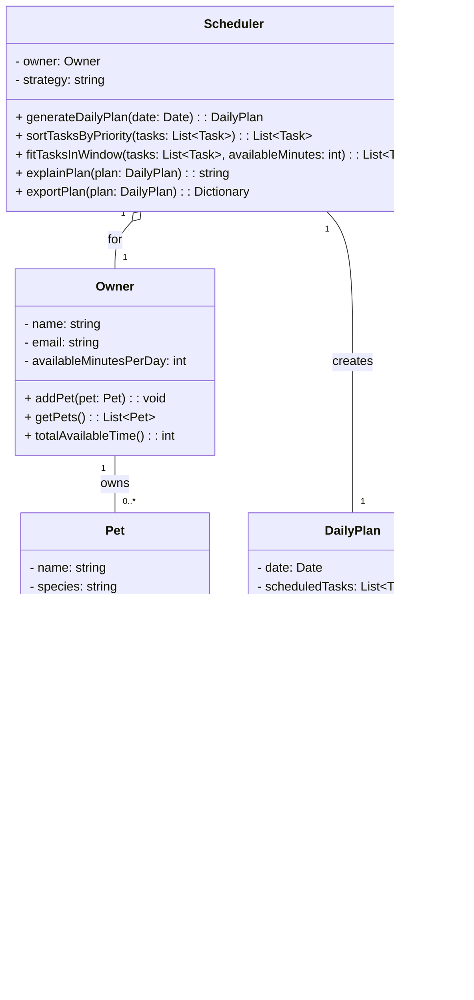

# PawPal+ Project Reflection

## 1. System Design

**a. Initial design**

- Briefly describe your initial UML design.
Answer: 
 My initial UML design included five classes: Owner, Pet, Task, Scheduler, and DailyPlan.

- What classes did you include, and what responsibilities did you assign to each?
Answer:
 Owner holds the pet owner's personal info and their available time for the day, and is responsible for managing the collection of pets they own. Pet stores the animal's basic details and owns a list of care tasks associated with it. Task represents a single care action such as a walk, feeding, or medication dose — each task has a name, category, duration in minutes, and a priority level. Scheduler is the core engine of the app: it takes the owner's time budget and their pets' tasks, sorts and filters them by priority, fits them within the available time, and produces an explained daily plan. Finally, DailyPlan is the output object that holds the scheduled tasks for a given day along with a reasoning summary and total time.

The relationships between classes follow a composition model: an Owner has one or more Pets, and each Pet has zero or more Tasks. The Scheduler depends on Owner to access that data, and produces a DailyPlan which references the selected Task objects.

**b. Design changes**

- Did your design change during implementation?
- If yes, describe at least one change and why you made it.
Answer:
 Yes — one useful design evolution was adding an optional `dueTime` field to the `Task` class so overdue logic could be automated, and making `Scheduler` explicitly store a scheduling strategy (such as "priority-first" or "earliest-due"). This change improved real-world accuracy for time-sensitive tasks and made the plan explanation richer.

 During implementation, three further refinements emerged. First, a `ScheduledEntry` dataclass was added to pair each scheduled `Task` with its pet's name, so `DailyPlan` could produce meaningful output like "Mochi: Morning walk" rather than a nameless task list. Second, `fitTasksInWindow` was changed to return both the scheduled tasks and the skipped ones as a tuple, because `explainPlan` needs to know what was left out and why. Third, the redundant `exportPlan` method was removed from `Scheduler` since `DailyPlan.toDict()` already covers serialisation — keeping both would have violated the principle that a class should own its own data.

- Additional system design artifact:

---

## 2. Scheduling Logic and Tradeoffs

**a. Constraints and priorities**

- What constraints does your scheduler consider (for example: time, priority, preferences)?
- How did you decide which constraints mattered most?

**b. Tradeoffs**

- Describe one tradeoff your scheduler makes.
- Why is that tradeoff reasonable for this scenario?

---

## 3. AI Collaboration

**a. How you used AI**

- How did you use AI tools during this project (for example: design brainstorming, debugging, refactoring)?
- What kinds of prompts or questions were most helpful?

**b. Judgment and verification**

- Describe one moment where you did not accept an AI suggestion as-is.
- How did you evaluate or verify what the AI suggested?

---

## 4. Testing and Verification

**a. What you tested**

- What behaviors did you test?
- Why were these tests important?

**b. Confidence**

- How confident are you that your scheduler works correctly?
- What edge cases would you test next if you had more time?

---

## 5. Reflection

**a. What went well**

- What part of this project are you most satisfied with?

**b. What you would improve**

- If you had another iteration, what would you improve or redesign?

**c. Key takeaway**

- What is one important thing you learned about designing systems or working with AI on this project?
